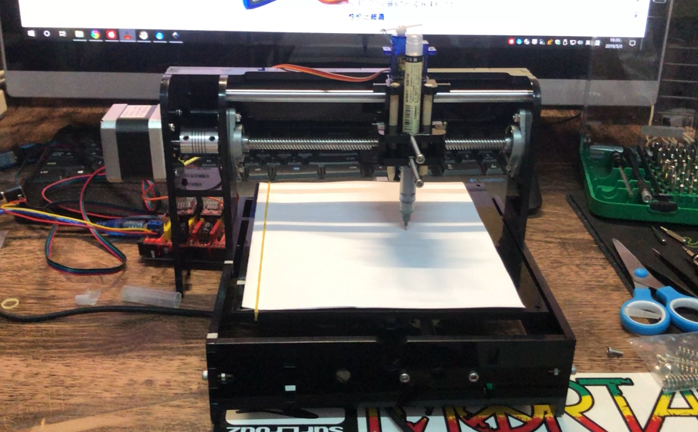
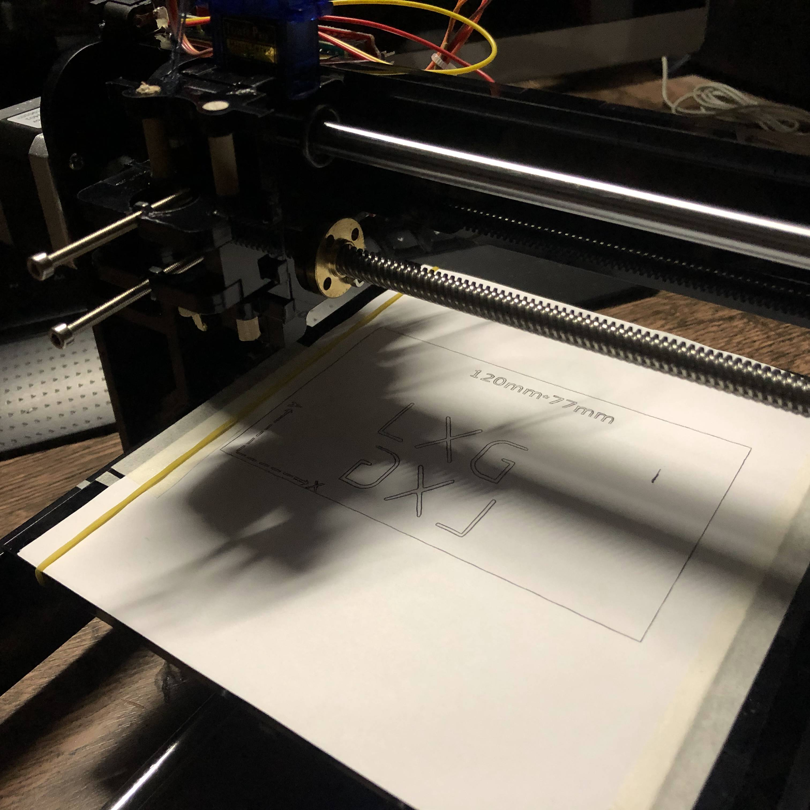
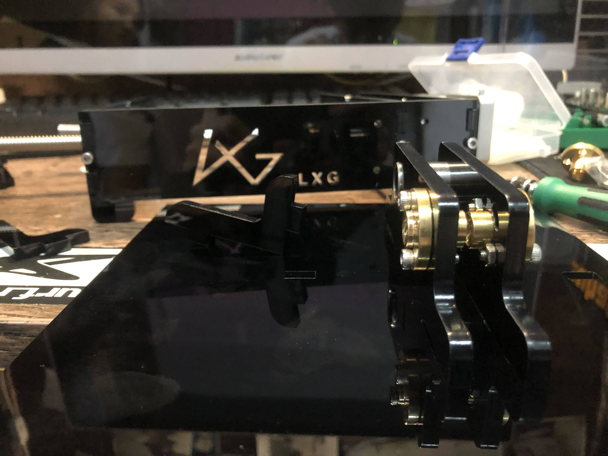

# exArtist_写字机

Github:[点我传送](https://github.com/firestaradmin/exArtist_drawer)

## 一、简介

exArtist_写字机是我基于arduino主控制作的第一款，Artist系列作品。

主控用的是arduino官方开发板，G-code解释器是网上开源的grbl。

机械部分设计，是使用solidworks设计的。

此作品为测试，和兴趣。初学建模，和单片机，水平有限。

### 靓照：

